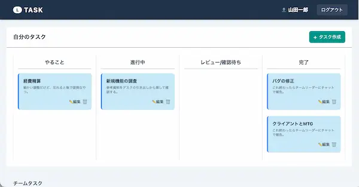
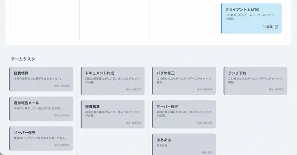
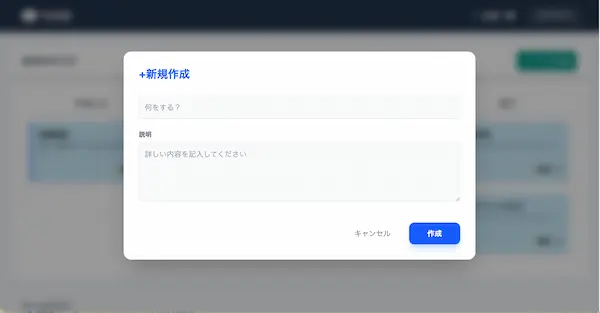
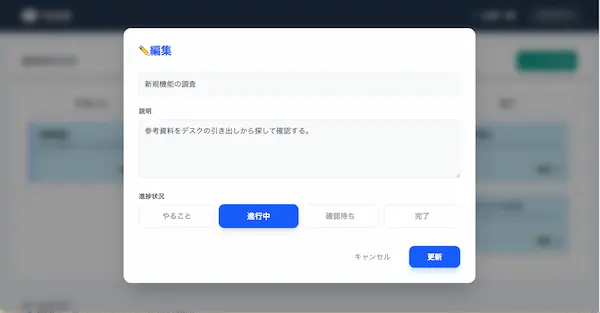
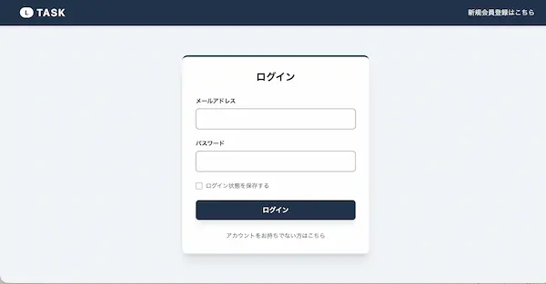
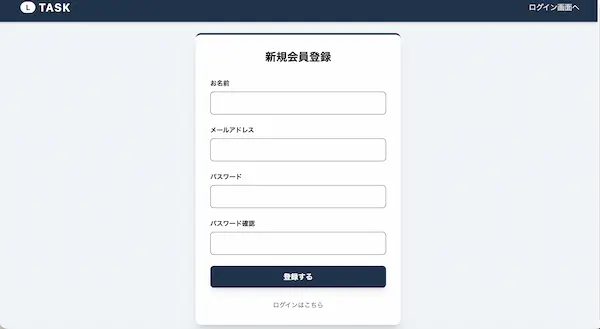

# タスク進捗管理アプリ

Laravel (Sanctum) と React を連携させた、SPA（シングルページアプリケーション）構成のタスク管理システムです。

## プロジェクトの概要

このシステムは、一般ユーザーが自身のアカウントを作成し、個別のタスクを管理（作成・編集・削除・ステータス更新）できるアプリケーションです。

https://github.com/user-attachments/assets/04a19d85-89fc-47eb-b29d-f320c70729fd

## 使用技術 (Tech Stack)

- Laravel 12
- PHP 8.4
- Laravel Sanctum (手動実装)
- MySQL
- React 18
- TypeScript
- Tailwind CSS
- Docker
- Axios

---

### 機能要件・基本設計・テーブル仕様書

- https://docs.google.com/spreadsheets/d/1CCZaAMHwLB64XeceLpMxzjfLm--qIAWGPmNKUe9nsUU/edit?usp=sharing
---

### 実装済み・実装予定の機能

### 1. 認証・認可 (Auth)

* **FN001/003 登録・ログイン**:
* **Laravel Sanctum (Cookie認証)** を採用。
* CSRF保護を有効にし、セッションベースで安全にログイン状態を管理。


* **FN005 ログアウト**:
* サーバー側のセッション破棄と同時に、React側の状態（State）をクリアし、安全に終了。

* **認可ロジック (Policy)**:
* **自分専用**: 自分のタスクのみ「編集・削除・ステータス更新」のフル操作が可能。
* **チーム共有**: 他人のタスクは「閲覧のみ」に制限。
* **バックエンド防御**: フロントエンドでのボタン非表示に加え、API側でも **Laravel Policy** を用いて、不正なリクエスト（他人のタスク操作）を確実にブロック。


### 2. タスク管理 (Tasks)

* **FN008 一覧表示**:
* 自分のタスクと他人のタスクを視覚的に区別（自分には編集・削除ボタンを表示）。
* 「全員のタスク」と「自分のタスク」を切り替えるフィルタ機能。


* **FN009~012 CRUD操作**:
* タスクの新規登録・編集・削除。
* ステータス（やること・進行中・レビュー/確認待ち・完了）のワンクリック更新。


### 3. バリデーション (Validation)

* **Backend**: Laravel `FormRequest` による厳格な入力チェック。
* **Frontend**: TypeScript の型定義を用いた安全なデータ通信。
* **ルール**: タイトル必須、詳細は255文字以内、ステータス限定（todo, doing, review, done）。

---

## データベース設計 (Schema)

### users テーブル

| カラム名 | 型 | 詳細 |
| --- | --- | --- |
| `id` | unsigned bigint | プライマリキー |
| `name` | string | ユーザー名 |
| `email` | string | メールアドレス (Unique) |
| `password` | string | ハッシュ化されたパスワード |

### tasks テーブル

| カラム名 | 型 | 詳細 |
| --- | --- | --- |
| `id` | unsigned bigint | プライマリキー |
| `user_id` | unsigned bigint | 外部キー (users.id) |
| `title` | string | タスクのタイトル (必須) |
| `description` | text | タスクの詳細 |
| `status` | string | todo / doing / review / done (デフォルト: todo) |

---


#### ## セットアップ方法 (Setup)

このプロジェクトをローカル環境で起動するための手順です。

1. **リポジトリをクローンする**
```bash
git clone git@github.com:ando625/task.git taskapp
cd taskapp

```

2. **Dockerコンテナの起動**
```bash
docker compose up -d --build

```


3. プロジェクトのルートphp上で実行
```
docker compose exec php bash
```


4. **環境設定ファイルの準備**
```bash
cp .env.example .env

```

※ .env ファイルを開き、データベースの設定を以下のように書き換えてください：

```
DB_CONNECTION=mysql
DB_HOST=mysql
DB_PORT=3306
DB_DATABASE=laravel_db
DB_USERNAME=laravel_user
DB_PASSWORD=laravel_pass
```


5. **ライブラリのインストール (PHP & JavaScript)**

```bash
composer install
```

```
npm install
```
エラーが出た場合はこちらで
```
npm install --legacy-peer-deps
```


6. **アプリケーションキーの生成とデータベースの準備**
```bash
php artisan key:generate
php artisan migrate:fresh --seed
```


7. **フロントエンドのビルド（Viteの起動）**
```bash
npm run dev

```


8. **ブラウザで確認**
- URL: http://localhost/ にアクセスしてください。


- ログインURL: http://localhost/login
- 新規会員登録URL: http://localhost/register


#### テストユーザー

| メールアドレス        | パスワード |
|-----------------------|------------|
| yoshida@example.com | pass1234   |


| メールアドレス        | パスワード |
|-----------------------|------------|
| yamada@example.com | pass1234   |


**UserSeeder.phpで作成しているのでログインする前に一度確認してください**

- テストユーザー: 固定のログイン情報を作成。
- タスクデータ: 実務に近い12種類のタスク名と説明文をランダムに組み合わせ、ステータス（Todo/Doing/Doneなど）を割り振った状態で生成。
- チーム機能の検証: 他のユーザー（山田一郎など）のタスクも生成し、自分以外のタスクが表示される「チームエリア」の動作確認を可能にしています。


---


## phpMyAdmin

- URL: http://localhost:8080/
- ユーザー名・パスワードは `.env` と同じ
- DB: `laravel_db` を確認可能

---
## 画面デザイン







